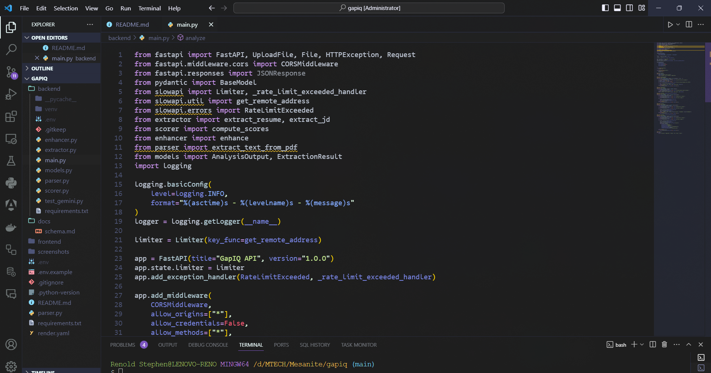
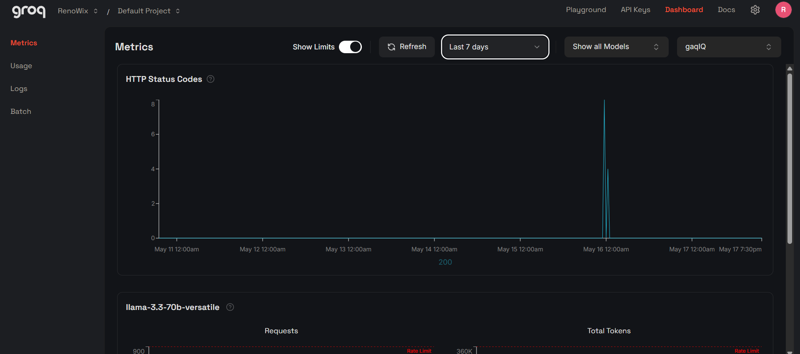
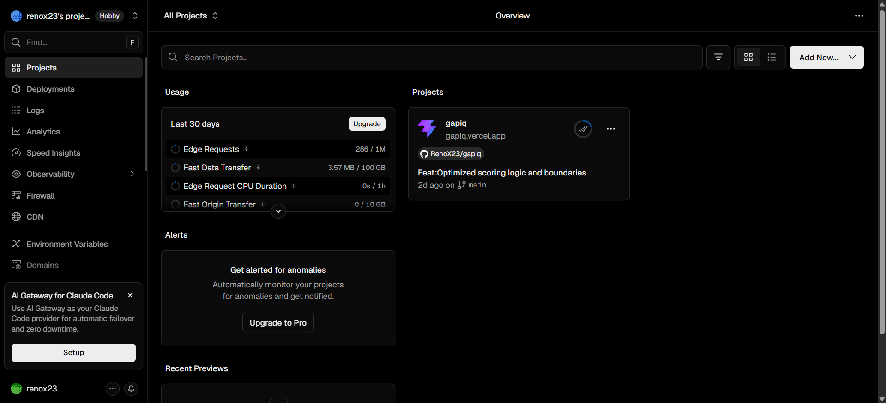
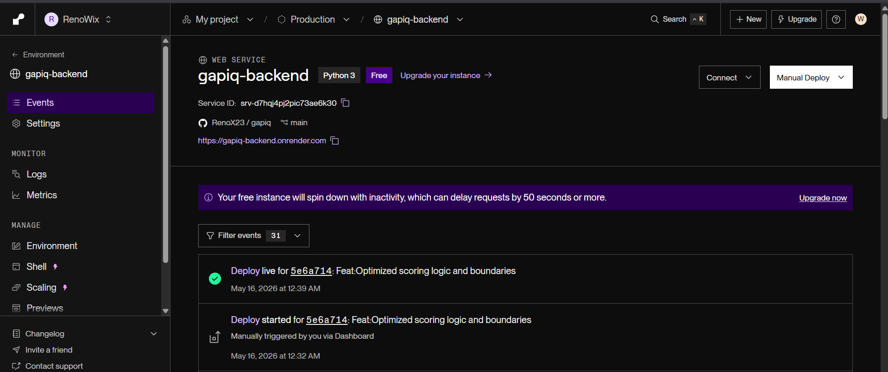
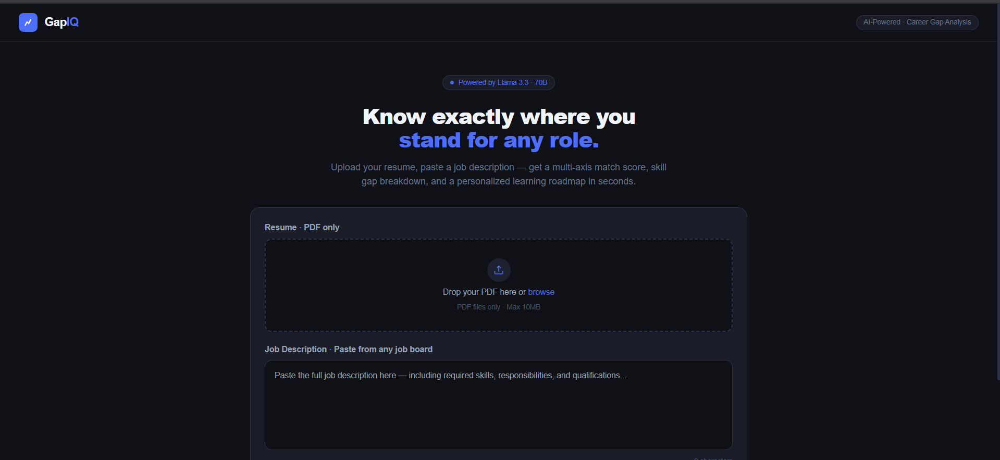
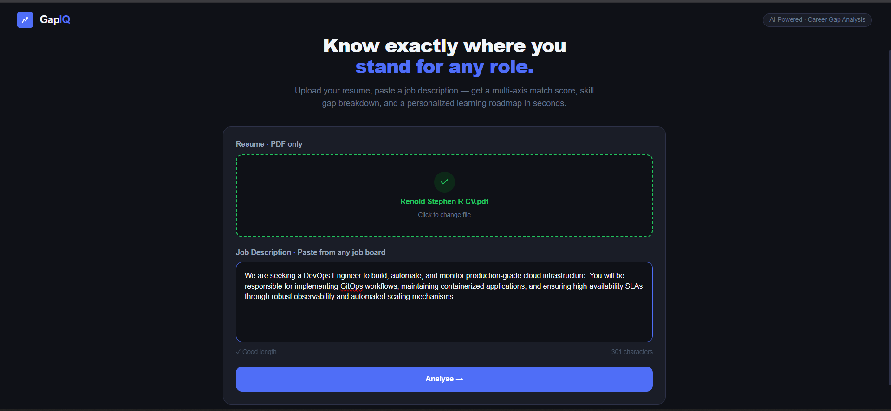
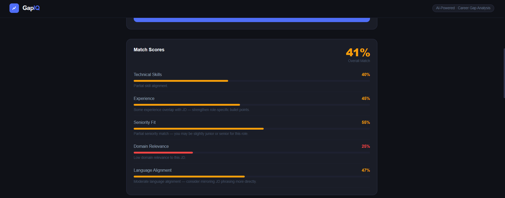
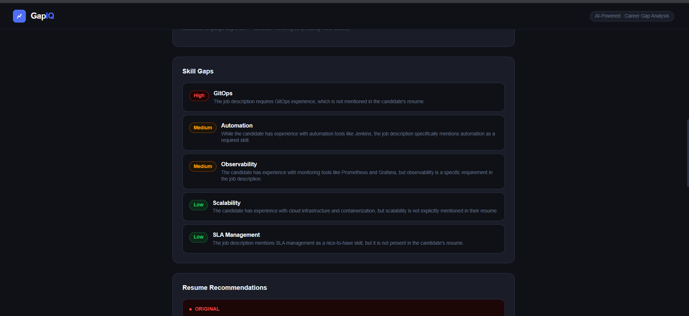
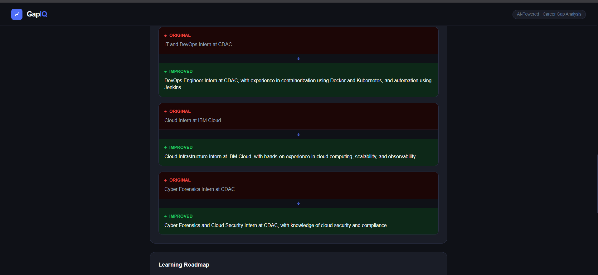
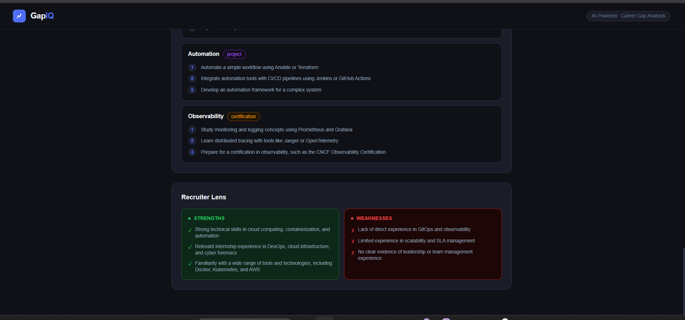

# GapIQ — AI-Powered Career Gap Analysis Platform

## Overview

GapIQ is an AI-powered career intelligence platform designed to analyze the gap between a candidate’s resume and a target job description. The system extracts structured information from resumes and job descriptions, computes deterministic compatibility scores, and generates explainable AI-driven insights including skill gaps, recruiter feedback, resume improvements, and personalized learning roadmaps.

The project was developed as part of the M.Tech internship and research work under Mesanite Software Solutions Pvt. Ltd. in collaboration with CHRIST (Deemed to be University), Bangalore.

---

# Problem Statement

Students and early-career professionals often receive repeated job rejections without understanding:

* Which skills are missing
* Whether their experience aligns with the role
* How recruiters evaluate their resumes
* What improvements are required to increase selection chances

Traditional ATS systems are opaque and rejection-oriented. GapIQ aims to provide an explainable and constructive alternative.

---

# Objectives

The primary objectives of GapIQ are:

* Perform automated resume and job description analysis
* Extract structured information using AI
* Compute multi-dimensional compatibility scores
* Identify missing skills and domain gaps
* Generate actionable recommendations
* Provide recruiter-style feedback
* Build a learning roadmap for improvement
* Maintain explainability and transparency in scoring

---

# Core Features

## Resume Parsing

* PDF resume upload support
* Text extraction using pdfplumber
* Noise cleaning and normalization
* Structured parsing pipeline

## Job Description Processing

* Raw JD text input
* Skill extraction
* Seniority detection
* Domain keyword identification

## Structured Extraction (Phase 3A)

GapIQ converts unstructured text into validated structured JSON using:

* Groq LLM
* Pydantic schema validation
* Deterministic formatting

Extracted entities include:

* Skills
* Experience signals
* Keywords
* Seniority indicators
* Required skills
* Nice-to-have skills

## Deterministic Scoring Engine (Phase 3B)

GapIQ computes compatibility scores across multiple dimensions:

| Score Axis | Description                              |
| ---------- | ---------------------------------------- |
| Technical  | Skill overlap between resume and JD      |
| Experience | Experience relevance to job requirements |
| Seniority  | Career level alignment                   |
| Domain     | Domain and industry relevance            |
| Language   | Semantic language alignment              |

Scoring uses:

* TF-IDF vectorization
* Cosine similarity
* Heuristic matching
* Weighted scoring
* Skill overlap analysis

## AI Enhancement Layer (Phase 3C)

AI-generated insights include:

* Skill gap analysis
* Resume improvement suggestions
* Recruiter strengths and weaknesses
* Personalized learning roadmap

The enhancement layer is constrained to:

* Maximum 2 LLM calls
* Strict JSON output
* Pydantic validation
* Fallback-safe execution

## Explainability Layer

GapIQ emphasizes transparent evaluation.

The platform provides:

* Matched skills
* Missing skills
* Priority-based gaps
* Compatibility labels
* Human-readable explanations

---

# System Architecture

```text
Frontend (React + Tailwind)
        ↓
FastAPI Backend
        ↓
Resume Parser + JD Processor
        ↓
Structured Extraction Layer
        ↓
Deterministic Scoring Engine
        ↓
LLM Enhancement Layer
        ↓
Final Analysis Response
```

---

# Tech Stack

## Frontend

| Technology   | Purpose             |
| ------------ | ------------------- |
| React        | UI Framework        |
| Vite         | Frontend Build Tool |
| Tailwind CSS | Styling             |
| Axios        | API Communication   |

## Backend

| Technology    | Purpose                     |
| ------------- | --------------------------- |
| FastAPI       | API Backend                 |
| Pydantic      | Data Validation             |
| pdfplumber    | Resume PDF Parsing          |
| Scikit-learn  | TF-IDF + Similarity Scoring |
| Groq API      | LLM Inference               |
| Python-dotenv | Environment Management      |

## Deployment

| Platform         | Usage            |
| ---------------- | ---------------- |
| Render           | Backend Hosting  |
| Vercel / Netlify | Frontend Hosting |

---

# Project Structure

```text
gapiq/
│
├── backend/
│   ├── main.py
│   ├── extractor.py
│   ├── scorer.py
│   ├── enhancer.py
│   ├── models.py
│   ├── requirements.txt
│   ├── .env
│   └── uploads/
│
├── frontend/
│   ├── src/
│   │   ├── components/
│   │   ├── App.jsx
│   │   └── main.jsx
│   ├── package.json
│   └── vite.config.js
│
└── docs/
```

---

# Backend API Documentation

## Base URL

```text
http://localhost:8000
```

---

# API Endpoints

## Health Check

### Endpoint

```http
GET /health
```

### Purpose

Checks whether backend service is active.

### Response

```json
{
  "status": "ok"
}
```

---

## Resume Parsing

### Endpoint

```http
POST /parse/resume
```

### Input

Multipart PDF file upload.

### Output

```json
{
  "text": "parsed resume text"
}
```

---

## Structured Extraction

### Endpoint

```http
POST /extract
```

### Input

```json
{
  "resume_text": "...",
  "jd_text": "..."
}
```

### Output

```json
{
  "resume": {
    "skills": [],
    "experience": [],
    "keywords": [],
    "seniority_signals": []
  },
  "jd": {
    "required_skills": [],
    "nice_to_have": [],
    "keywords": [],
    "seniority": ""
  }
}
```

---

## Deterministic Scoring

### Endpoint

```http
POST /score
```

### Output

```json
{
  "scores": {
    "technical": 78,
    "experience": 72,
    "seniority": 65,
    "domain": 70,
    "language": 80,
    "overall": 74,
    "role_fit": "Moderate Match"
  }
}
```

---

## Full Analysis

### Endpoint

```http
POST /analyze
```

### Output

```json
{
  "scores": {},
  "gaps": [],
  "recommendations": [],
  "roadmap": [],
  "recruiter_lens": {}
}
```

---

# Scoring Methodology

## Technical Score

Calculated using:

* Direct skill overlap
* TF-IDF fallback similarity
* Partial semantic alignment

## Experience Score

Computed using:

* TF-IDF similarity between:

  * Resume experience
  * JD requirements

## Seniority Score

Uses heuristic matching against predefined career-level keywords.

## Domain Score

Measures overlap between:

* Resume keywords
* JD keywords

## Language Score

Measures semantic alignment between:

* Overall resume profile
* Overall job description profile

## Overall Score

Weighted aggregation:

```python
weighted = (
    technical * 0.35 +
    experience * 0.30 +
    seniority * 0.10 +
    domain * 0.15 +
    language * 0.15
)
```

Compatibility classification:

| Overall Score | Classification  |
| ------------- | --------------- |
| 75+           | Strong Match    |
| 55–74         | Moderate Match  |
| 40–54         | Potential Match |
| Below 40      | Weak Match      |

---

# Frontend UI Components

| Component             | Purpose                        |
| --------------------- | ------------------------------ |
| UploadSection         | Resume upload + JD input       |
| ScoreSection          | Compatibility visualization    |
| GapSection            | Missing skills display         |
| RecommendationSection | Resume improvement suggestions |
| RoadmapSection        | Learning roadmap               |
| RecruiterSection      | Recruiter perspective analysis |

---

# Screenshots 📸













# Installation Guide

# Clone Repository

```bash
git clone <repository-url>
cd gapiq
```

---

# Backend Setup

## Create Virtual Environment

```bash
cd backend
python -m venv venv
```

## Activate Virtual Environment

### Windows

```bash
source venv/Scripts/activate
```

### Linux / Mac

```bash
source venv/bin/activate
```

## Install Dependencies

```bash
pip install -r requirements.txt
```

## Configure Environment Variables

Create `.env`

```env
GROQ_API_KEY=your_api_key_here
```

## Run Backend

```bash
uvicorn main:app --reload
```

Backend URL:

```text
http://127.0.0.1:8000
```

---

# Frontend Setup

## Install Dependencies

```bash
cd frontend
npm install
```

## Run Frontend

```bash
npm run dev
```

Frontend URL:

```text
http://localhost:5173
```

---

# Deployment Guide

# Backend Deployment (Render)

## Recommended Configuration

### Root Directory

```text
backend
```

### Build Command

```bash
pip install -r requirements.txt
```

### Start Command

```bash
uvicorn main:app --host 0.0.0.0 --port $PORT
```

### Environment Variables

```env
GROQ_API_KEY=your_api_key
```

---

# Frontend Deployment

Deploy frontend separately using:

* Vercel
* Netlify

Update API base URLs after deployment.

---

# Design Principles

GapIQ follows these core principles:

## Explainability First

Every score must be understandable.

## Hybrid AI Architecture

Combines:

* Deterministic scoring
* LLM enhancement

## Minimal LLM Dependence

The system minimizes:

* hallucination risk
* API cost
* latency

## Lightweight Infrastructure

Avoids:

* heavy GPU inference
* local transformer hosting
* unnecessary ML overhead

---

# Current Limitations

* Resume parsing may vary across complex PDF layouts
* LLM extraction quality depends on resume formatting
* Domain understanding is keyword dependent
* TF-IDF similarity lacks deep semantic reasoning
* No authentication system currently implemented
* No database persistence layer yet

---

# Future Enhancements

## Technical Improvements

* Embedding API integration
* Adaptive scoring weights by role type
* Resume section segmentation
* ATS compatibility scoring
* Multi-resume comparison
* Historical analytics dashboard

## Research Enhancements

* Confidence-aware scoring
* Explainable AI evaluation metrics
* Hybrid semantic retrieval
* Role-specific calibration models
* Bias analysis in resume evaluation

## Product Features

* User authentication
* Resume history
* Exportable reports
* Skill trend analytics
* Personalized job recommendations
* Recruiter dashboard

---

# Research Scope

GapIQ also serves as a research-oriented project in:

* Explainable AI for recruitment
* Intelligent career guidance systems
* Resume-job semantic alignment
* Human-centered AI scoring systems
* Hybrid deterministic + generative architectures

---

# Security Considerations

* API keys stored using environment variables
* File upload validation required
* Rate limiting recommended
* Input sanitization required
* Sensitive resume data should not be permanently stored without consent

---

# Performance Optimizations

Implemented optimizations include:

* Limited LLM calls
* Lightweight TF-IDF scoring
* Pydantic validation
* Structured logging
* Controlled output schemas

Recommended future optimizations:

* Redis caching
* Async processing
* Background task queues
* Request batching

---

# Contributors

## Project Developer

Renold Stephen R

M.Tech Computer Science and Engineering
CHRIST (Deemed to be University)

---

# Acknowledgements

* CHRIST (Deemed to be University)
* Groq
* FastAPI Community
* Open-source NLP ecosystem

---

# License

This project is currently developed for academic and research purposes.

Further licensing decisions may be applied during production release.

---

# Final Note

GapIQ is designed not merely as an ATS-style rejection system, but as an explainable AI career guidance platform focused on helping candidates understand, improve, and strategically align themselves with industry roles.
